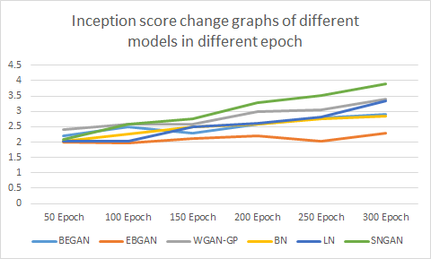
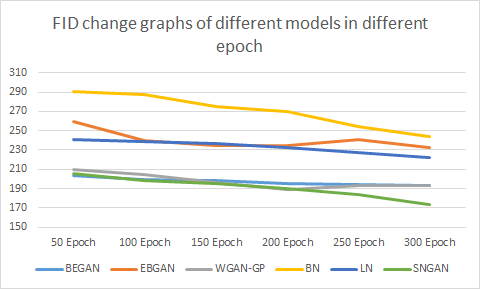
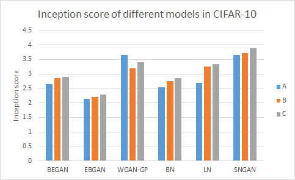
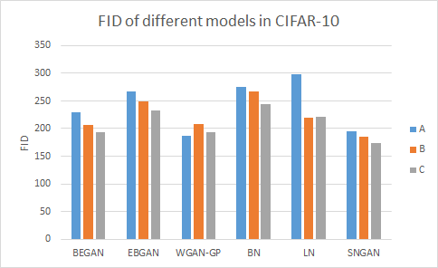
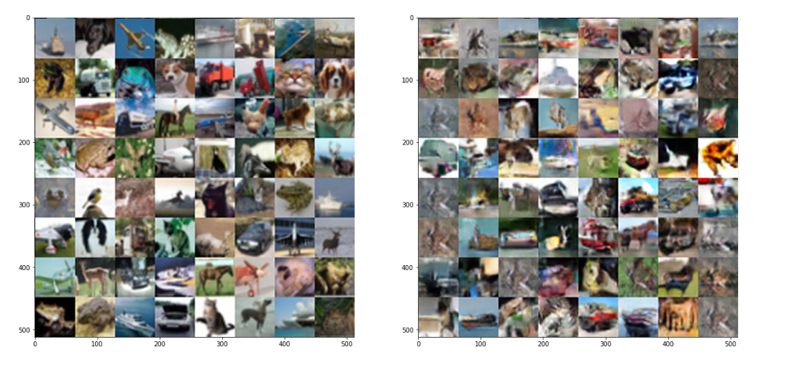

# SPECTRAL NORMALIZATION FOR GENERATIVE ADVERSARIAL NETWORKS

This repository is mainly for reproduce a paper : [SPECTRAL NORMALIZATION FOR GENERATIVE ADVERSARIAL NETWORKS](https://arxiv.org/abs/1802.05957)<br>

We compare the difference between SNGAN and some other versions of gan, such as WGAN-GP,BEGAN,EBGAN and DCGAN based on BN and LN.<br>

These codes are evaluated with the inception score and Fréchet Inception Distance on Cifar-10 dataset.<br>

The implementation of WGAN-GP, BEGAN and EBGAN is based on:[pytorch-generative-model-collections](https://github.com/znxlwm/pytorch-generative-model-collections)

The implementation of DCGAN using BN and LN is based on: [chainer-gan-lib](https://github.com/pfnet-research/chainer-gan-lib)

The implementation of FID score is based on: [pytorch-fid](https://github.com/mseitzer/pytorch-fid)

The implementation of the Inception score is based on: [inception-score-pytorch](https://github.com/sbarratt/inception-score-pytorch)

SNGAN's code is implemented by ourselves.
## How to use

Install the requirements first:
```
pip install -r requirements.txt
```

### If need use the BN_DCGAN OR LN_DCGAN code

you should download the inception score module fokred from: [chainer-inception-score](https://github.com/hvy/chainer-inception-score)

and download the inception model.
```
cd common/inception
python download.py --outfile inception_score.model
```
You can start training with ```train.py```.
```
train.py --gpu 0 --algorithm dcgan --batchsize 64 --out drive/res --adam_alpha 0.0002 --adam_beta1 0.5 --adam_beta2 0.9
```

# Quantitative evaluation
| | [Inception](https://arxiv.org/abs/1606.03498)  | [FID](https://arxiv.org/abs/1706.08500) |
| ------------- | ------------- | ------------- |
| Real data  | 9.6727  | 17.2690 (train vs test) |
| [SN-DCGAN](https://drive.google.com/file/d/0B8HZ50DPgR3eSVV6YlF3XzQxSjQ/view?usp=sharing)  | 3.8849 | 173.387 |
| [DCGAN-BN](https://arxiv.org/abs/1502.03167)  | 2.8561 | 243.652 |
| [DCGAN-LN](http://adsabs.harvard.edu/abs/2016arXiv160706450L)  | 3.3469 | 219.825 |
| [WGAN-GP](https://arxiv.org/abs/1704.00028)  | 3.6489 | 186.357 |
| [BEGAN](https://arxiv.org/abs/1703.10717)  | 2.8899 | 193.063 |
| [EBGAN](https://arxiv.org/abs/1609.03126)  | 2.2915 | 232.225 |

Inception scores are calculated by average of 10 evaluation with 6000 samples.

FIDs are calculated with 50000 train dataset and 6000 generated samples.

The score is the best score in 300 epochs

# The performances of different GANs

- Inception score change graphs of different models in different epoch 



- FID change graphs of different models in different epoch 



- Inception score of different models in CIFAR-10



- FID of different models in CIFAR-10




# Generated images

- Real data VS SNGAN 



# Report
The Report can be found [here](ICLR_reproducibility_of_SNGAN.pdf)
